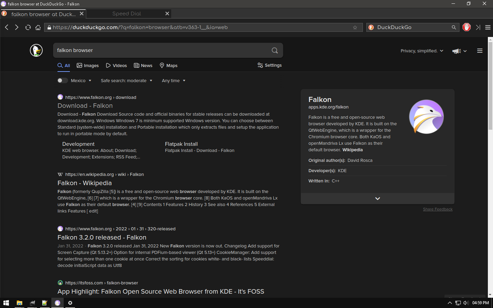

# Win10Dark
Dark Version of default "Windows" theme included by default in Falkon Browser

</img>

this theme include:

- White buttons adapted to dark themes 
- Dark UI (Menus, Settings, Downloads)

Recomendations:

- Set dark window border from Windows settings, or using regedit (this second option has better results)
- Install some GreaseMonkey userscript to have dark mode on all pages

