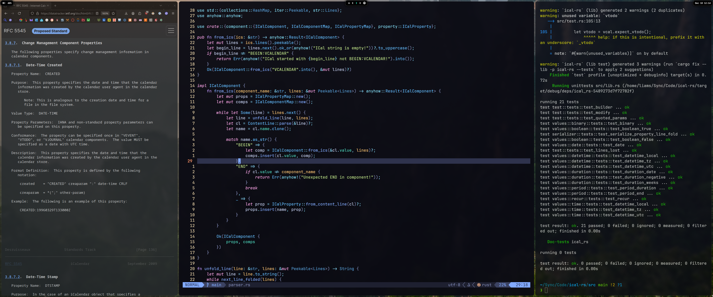

# Liam's Arch Linux Dotfiles 🏄🏽

Minimal/zen Arch linux config that also looks good.

A big goal of mine is speed which I achieved by doing as much
as I can in the terminal (IE Neovim) and then optimizing around that:
 - open with `Super+Enter`
 - many zsh aliases (IE `sc` for `sudo systemctl`)
 - navigation with zoxide & yazi

This same config is configured to work for both my laptop and PC.
Both of which run syncthing so configurations and files (under `~/Sync`)
are always identical between them.

## Setup
 - Hyprland (Wayland) wo/ desktop manager
 - floating minimal Waybars
 - Kitty + Zsh + Zinit

