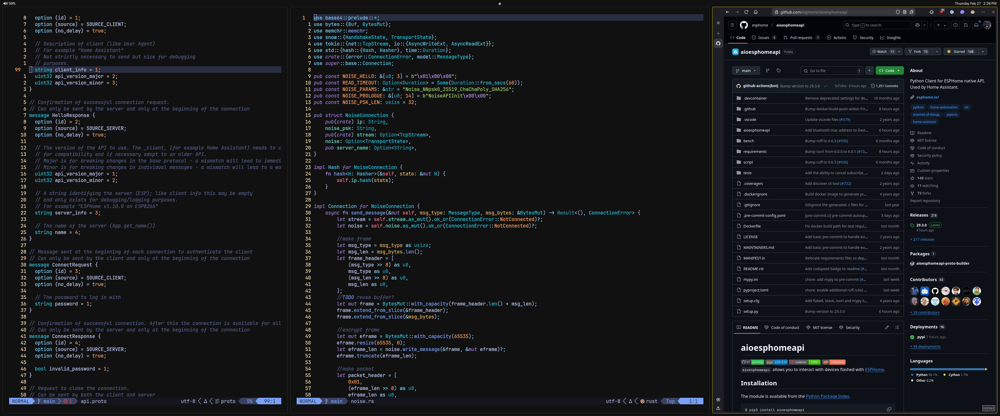

# Liam's Arch Linux Dotfiles 🏄🏽

It's not flashy, and it's not the prettiest thing ever,
but its very productive and there are no distractions.

 1. No flashy Waybar displaying my RAM usage and other useless things. I open btop in less than a second if I need to see usage.
 2. More frequent keybinds are placed in easy-to-press locations
     1. Switching desktops uses `w`,`e`,`a`,`s`,`d` which is much faster than using numbers. Alternatively, I can just click on the left eww sidebar.
     2. 99% of the time I'm just using the terminal and browser, so I've given them `Super+Enter`, and `Super+Backspace` which are easy to press.
 3. Fast navigation:
     1. Aliases to move to common directories (ex. `c` -> `~/Sync/Code`)
     2. ZOxide for non hard-coded locations (ex. current projects)
     3. Yazi + Vim keybinds to move to other locations

Using Syncthing, this config is automatically synced between all my computers. 

## Setup
 - [Niri](https://github.com/YaLTeR/niri): Scrollable-tiling Wayland compositor. I used to use Hyprland, but switched because it would break all the time. Niri has been nothing but a dream to use. I was initially skeptical of the scrolling aspect, but it makes for such an amazing user experience. 
 - [Helix](https://helix-editor.com/): I used Neovim for quite a while, but it just breaks too much and requires too much configuring to get right. Helix takes a bit of an adjustment period but is very worthwhile. It is such a great experience.
 - [Yazi](https://yazi-rs.github.io/): Absolutely amazing and fast TUI file manager. I could not imagine not having this.
 - [Fish Shell](https://fishshell.com/): Great features and easy to use. I tried Nushell for a while, but it was just a pain. Fish has been a great experience. No need to deal with Zsh package managers or anything.
 - [eww](https://github.com/elkowar/eww): A little hard to configure, but I like how flexible it is. I have liked it more than Waybar.
 - [Ghostty](https://ghostty.org/): Not much to say about it. In my opinion its pretty equal to Kitty.
 - [Zen Browser](https://zen-browser.app/): Really nice experience over pure Firefox. Horizontal tabs save on-screen space and distractions.

